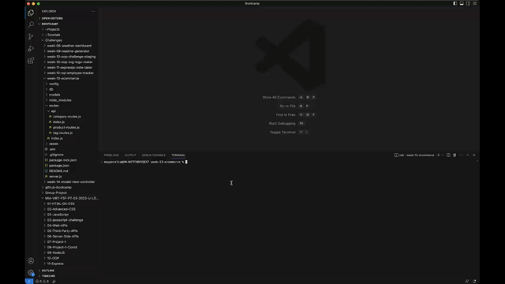

# 13 Object-Relational Mapping (ORM): E-Commerce Back End

# Description

The challenge is to build a back-end for an e-commerce site by modifying the starter code. It involves configuring a working Express.js API to use Sequelize to interact with a MySql database. 

The tasks included building the models associated with the DB tables (Category, Product, Product Tag, Tag), modifying the routes, and using Insomnia to test GET, POST, PUT, and DELETE routes. 

## User Story

```md
AS A manager at an internet retail company
I WANT a back end for my e-commerce website that uses the latest technologies
SO THAT my company can compete with other e-commerce companies
```

# Technologies used

* JS
* Node.js
* MySQL
* Insomnia
* Dependencies 
    - dotenv 8.2.0
    - express 4.17.1
    - mysql2 2.1.0
    - sequelize 5.22.5

# How to Install

On the Visual Studio terminal do the following: 

* Install [Node.js](https://nodejs.org/) if it is not installed on your machine
* git clone https://github.com/mayperalta/week-13-ecommerce.git
* npm init 
* install the dependencies
* Connect to mySQL by adding an .ENV file containing the DB name, user, and password

On Insomnia, do the following:

* Add a New Environment ("domain": "http://localhost:3001/api")
* Create folders (CATEGORIES, PRODUCTS, TAGS)
* Create New HTTP Request for each folder
    - CATEGORIES
        - VIEW categories -> GET {{domain}}/categories
        - CREATE category -> POST {{domain}}/categories
        - VIEW category by ID -> GET {{domain}}/categories/8
        - UPDATE category by ID ->  PUT {{domain}}/categories/8
        - DELETE category by ID -> DELETE {{domain}}/categories/8
    - PRODUCTS
        - VIEW products -> GET {{domain}}/products
        - CREATE product -> POST {{domain}}/products
        - VIEW product by ID -> GET {{domain}}/products/5
        - UPDATE product by ID -> PUT {{domain}}/products/5
        - DELETE product by ID -> DELETE {{domain}}/products/5
    - TAGS
        - VIEW tags -> GET {{domain}}/tags
        - CREATE tag -> POST {{domain}}/tags
        - VIEW tag by ID -> GET {{domain}}/tags/9
        - UPDATE tag by ID -> PUT {{domain}}/tags/9
        - DELETE tag by ID -> DELETE {{domain}}/tags/9

# How to Use 

On MySQL Workbench, do the following:

* Create Database by pasting content from /db/schema.sql 
* Then execute 

On the Visual Studio terminal, do the following:

* npm run seed
* npm start

On Insomnia, do the following:

* Select an HTTP REQUEST from each folder then click SEND
* Make POST and PUT request with the following JSON body content

- CATEGORY
```
    {
	"category_name": "STRING INPUT"
    }
```

- PRODUCTS
```
    {
	"product_name": "STRING INPUT",
    "price": DECIMAL INPUT,
    "stock": INTEGER INPUT,
    "tagIds": [INTEGER INPUT]
}
```
- TAGS
```
    {
	"category_name": "STRING INPUT"
    }
```

# Mock up

The video below demonstrates how to run the seed and connect to the localhost:



Here's the video link: https://drive.google.com/file/d/1fx6spolH5KyjzqdxdB7ohw4otlAIFLUh/view 


The video below is a demonstration of all API routes using Insomnia:


Here's the video link: https://drive.google.com/file/d/1Y8ZaHiuxoc9jcO_QweMYsR3BQuLE5M0P/view 


# Questions

Contact: 

* Github - https://github.com/mayperalta/week-13-ecommerce 
* Email - mayperalta@gmail.com 
